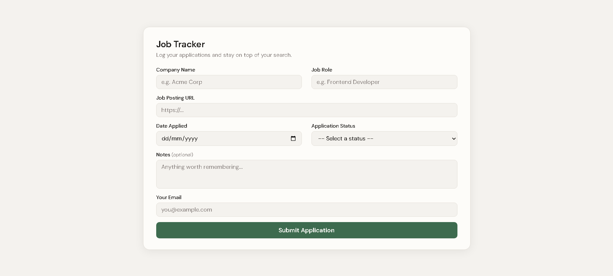

# 📋 Job Application Tracker

A clean, responsive job application tracking web app that sends form data to an n8n webhook — automatically logging submissions to Google Sheets and sending a confirmation email via Gmail.



---

## ✨ Features

- Real-time form validation (empty fields, email format, URL format)
- Loading state with disabled fields during submission
- Success and error feedback messages
- Auto-hides success message after 4 seconds
- No page reload on submit
- Automatic logging to Google Sheets
- Confirmation email sent via Gmail
- Mobile responsive design
- Clean minimalist UI with smooth transitions and hover effects

---

## 🔄 How It Works

1. User fills out the application form (company, role, URL, date, status, notes, email)
2. Form validates inputs and sends a JSON POST request to an n8n webhook
3. n8n logs the submission as a new row in Google Sheets
4. n8n sends a confirmation email to the user via Gmail
5. User sees a success message in the browser

---

## 🛠️ Tech Stack

**Frontend:**
- HTML5
- CSS3 (custom variables, CSS Grid, transitions)
- JavaScript (ES6+, Fetch API, async/await)

**Backend / Automation:**
- [n8n](https://n8n.io/) — webhook automation
- [Google Sheets](https://sheets.google.com/) — submission logging
- [Gmail](https://gmail.com/) — confirmation email

---

## 📁 File Structure

```
Job-Tracker/
├── index.html    — form structure and markup
├── style.css     — styling, grid layout, and responsive design
├── script.js     — validation, submission, and UI state logic
└── README.md     — project documentation
```

---

## 🚀 Getting Started

### 1. Clone the repo:
```bash
git clone https://github.com/mors-codes/job-tracker.git
cd Job-Tracker
```

### 2. Set up n8n workflow:

**Create a new workflow:**
1. Add a **Webhook** node as the trigger
2. Set HTTP Method to **POST** and path to `job-tracker`
3. Under Options, set **Allowed Origins (CORS)** to `*`
4. Copy the **Production URL**

**Add nodes:**
1. **Google Sheets → Append Row** — logs submission data to your spreadsheet
2. **Gmail → Send a Message** — sends confirmation email to the user

### 3. Configure the webhook URL:

Open `script.js` and replace the placeholder on line 1:
```javascript
const WEBHOOK_URL = "https://your-instance.app.n8n.cloud/webhook/job-tracker";
```

### 4. Test it out:

Open `index.html` in your browser — no installs, no build steps, no dependencies.

> Make sure to click **Publish** in n8n so the production webhook is active before testing.

---

## 📋 Google Sheets Structure

Create a spreadsheet named `Job Tracker` with these headers in row 1:

| A | B | C | D | E | F | G |
|---|---|---|---|---|---|---|
| Company | Role | URL | Date | Status | Notes | Email |

Map each column in n8n using:
- `{{ $json.body.company }}`, `{{ $json.body.role }}`, `{{ $json.body.url }}`, `{{ $json.body.date }}`, `{{ $json.body.status }}`, `{{ $json.body.notes }}`, `{{ $json.body.email }}`

---

## 📧 Gmail Confirmation Email

The confirmation email is sent using this template in the n8n Gmail node:

```html
<h2>Job Application Logged</h2>
<p><strong>Company:</strong> {{ $('Webhook').item.json.body.company }}</p>
<p><strong>Role:</strong> {{ $('Webhook').item.json.body.role }}</p>
<p><strong>URL:</strong> {{ $('Webhook').item.json.body.url }}</p>
<p><strong>Date Applied:</strong> {{ $('Webhook').item.json.body.date }}</p>
<p><strong>Status:</strong> {{ $('Webhook').item.json.body.status }}</p>
<p><strong>Notes:</strong> {{ $('Webhook').item.json.body.notes }}</p>
```

---

## 🎨 Design Details

- Off-pure colors (no pure black/white)
- Warm off-white background (`#f4f2ee`)
- Accent color: forest green (`#3d6b4f`)
- Google Fonts: DM Sans
- 2-column CSS Grid layout on desktop, single column on mobile
- Focus states with green glow
- Button hover lift effect
- Feedback messages with color-coded backgrounds

---

## ✅ Form Validation Rules

| Field | Rule |
|---|---|
| Company Name | Cannot be empty |
| Job Role | Cannot be empty |
| Job Posting URL | Cannot be empty, must start with `http://` or `https://` |
| Date Applied | Cannot be empty |
| Application Status | Must select an option |
| Email | Cannot be empty, must match email format |
| Notes | Optional |

---

## 📄 License

This project is open source and available under the [MIT License](LICENSE).